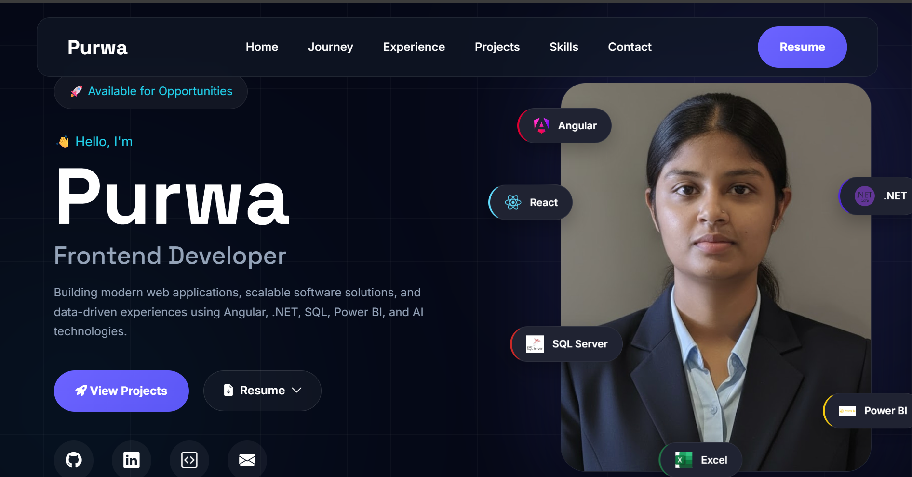
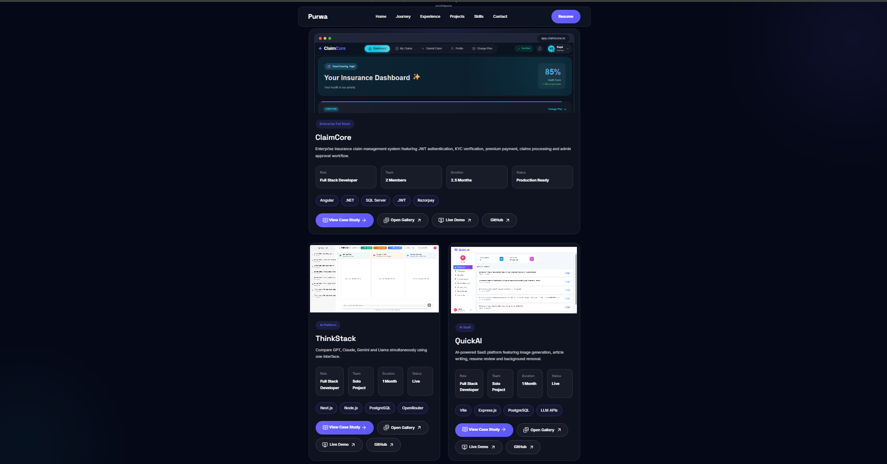
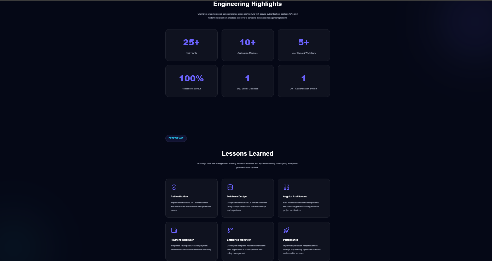
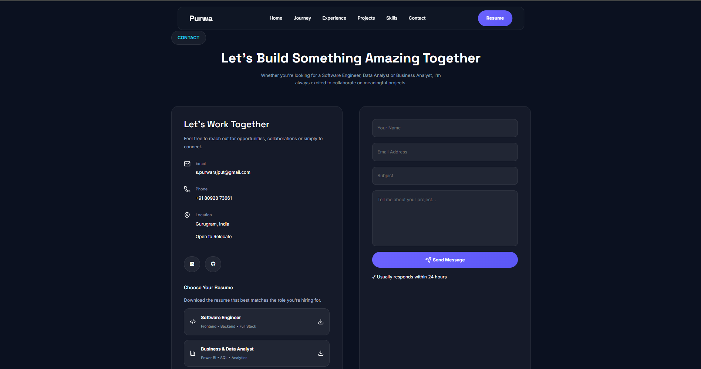

<div align="center">

# 🌐 Purwa Portfolio

### Modern Developer Portfolio showcasing Software Engineering, Data Analytics & Business Analysis

<p>

<a href="https://purwa-portfolio.vercel.app/">

</a>

<a href="https://github.com/purwarajput/purwa-portfolio">

</a>

<a href="https://github.com/purwarajput/purwa-portfolio/network">

</a>


</p>

</div>

---

<p align="center">

</p>

---

# 📖 Overview

This portfolio is designed to showcase my professional journey, technical expertise, and real-world software projects through a modern, interactive and responsive experience.

It highlights my experience as a **Software Engineer**, **Data Analyst**, and **Business Analyst**, featuring enterprise applications, AI solutions, internships, research publications, certifications, and detailed technical case studies.

---

# 🚀 Live Demo

### 🌐 Portfolio

👉 **https://purwa-portfolio.vercel.app/**

---

# ✨ Features

## 🎨 UI & Experience

- Modern Dark Theme
- Responsive across all devices
- Smooth Scroll Animations
- Interactive Sections
- Premium UI Design

## 💻 Portfolio

- Featured Projects Showcase
- Interactive Project Gallery
- Detailed Project Case Studies
- GitHub & Live Demo Links
- Technical Architecture Walkthroughs

## 📄 Professional

- Dual Resume Downloads
- Featured Achievements
- Research Publications
- Certifications
- Internship Experience

## ⚙️ Functionality

- EmailJS Contact Form
- SEO Optimized
- Custom Favicon
- Open Graph Support
- Hosted on Vercel

---

# 🛠 Tech Stack

| Category | Technologies |
|-----------|-------------|
| Frontend | HTML5, CSS3, JavaScript (ES6) |
| UI | Bootstrap 5, Bootstrap Icons, Font Awesome, Lucide Icons |
| Services | EmailJS |
| Deployment | Vercel |

---

# 📂 Project Structure

```text
purwa-portfolio/
│
├── assets/
│   ├── certificates/
│   ├── favicon/
│   ├── images/
│   ├── logos/
│   ├── projects/
│   ├── readme/
│   └── resume/
│
├── css/
│   ├── style.css
│   ├── responsive.css
│   ├── projects.css
│   └── case-study.css
│
├── js/
│   ├── app.js
│   ├── projects.js
│   └── case-study.js
│
├── index.html
├── claimcore.html
├── quickai.html
├── thinkstack.html
├── blinkit.html
└── README.md
```

---

# 📸 Project Preview

## 🏠 Home Page

<p align="center">

</p>

---

## 🚀 Featured Projects

<p align="center">

</p>

---

## 📚 Project Case Study

<p align="center">

</p>

---

## 📩 Contact Section

<p align="center">

</p>

---

# 💼 Featured Projects

### 🏥 ClaimCore

An enterprise-grade Insurance Claim Management System built using **Angular, ASP.NET Core, SQL Server, JWT Authentication and Razorpay Integration**, featuring secure authentication, claim processing, KYC verification and an admin approval workflow.

---

### 🧠 ThinkStack

An AI-powered knowledge management platform designed to organize information efficiently, featuring intelligent search, document management and modern responsive user interfaces.

---

### 🤖 QuickAI

A full-stack AI SaaS platform integrating multiple AI-powered utilities, secure authentication and modern UI to enhance productivity through intelligent automation.

---

### 📊 Blinkit Sales Dashboard

A comprehensive **Power BI Business Analytics Solution** built to visualize sales performance, customer insights and business KPIs through interactive dashboards, enabling data-driven decision making.

---

# 📚 Case Studies

Each featured project includes a detailed case study covering:

- Problem Statement
- Solution Overview
- Key Features
- Technology Stack
- Architecture
- Project Walkthrough
- Screenshots
- GitHub Repository
- Live Demo

---

# 📈 Lighthouse Report

| Category | Score |
|----------|------:|
| 🚀 Performance | **89** |
| ♿ Accessibility | **Improving** |
| ✅ Best Practices | **100** |
| 🔍 SEO | **92** |

---

# 🚀 Deployment

Hosted on **Vercel**

Clone the repository:

```bash
git clone https://github.com/purwarajput/purwa-portfolio.git

cd purwa-portfolio
```

Run using **VS Code Live Server**.

---

# 📊 Repository Stats

- 📁 4 Complete Case Studies
- 🎨 Premium Responsive Design
- 📱 Mobile Friendly
- 🌙 Dark Theme
- 📩 EmailJS Integration
- ⚡ Optimized Performance
- 🚀 Deployed on Vercel

---

# 📬 Connect With Me

### 🌐 Portfolio

https://purwa-portfolio.vercel.app/

### 💼 LinkedIn

https://www.linkedin.com/in/purwa-rajput/

### 💻 GitHub

https://github.com/purwarajput

### 📧 Email

s.purwarajput@gmail.com

---

<div align="center">

### ⭐ If you found this project useful, consider giving it a Star!

Made with ❤️ by **Purwa**

</div>